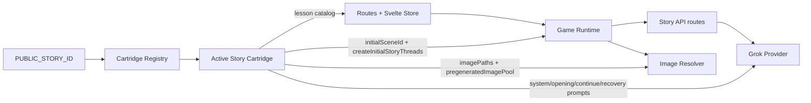

# Story Engine Abstraction Plan

## Research Summary (current `src/` state)

### Engine/runtime structure
- `src/lib/game/gameRuntime.ts` owns turn loop state transitions (`startGame`, `handleChoice`), settings persistence, and scene application.
- `src/lib/game/store.ts` is the Svelte store façade for UI interaction and runtime bootstrapping.
- `src/lib/services/storyService.ts` is the API-backed story service contract the runtime consumes.
- `src/routes/api/story/opening/+server.ts` and `src/routes/api/story/next/+server.ts` are server entry points for scene generation.
- `src/lib/server/ai/providers/grok.ts` is the concrete text+image provider integration and currently injects a hardcoded system prompt import.

### Sydney / No Vacancies hardcoded content locations
- `src/lib/server/ai/narrative.ts`
  - Story-specific SYSTEM_PROMPT and opening/continue/recovery prompt builders.
  - Story voice guidance and ending steering text.
- `src/lib/narrative/lessonsCatalog.ts`
  - No Vacancies lesson content (17 lessons).
- `src/lib/game/imagePaths.ts`
  - No Vacancies image key -> static path mapping and image pool.
- `src/lib/contracts/game.ts`
  - Story-thread shape defaults and opening scene id assumptions are currently globally hardcoded.

### Narrative state interfaces (TypeScript)
- `StoryThreads` (continuity dimensions): `oswaldoConflict`, `trinaTension`, `moneyResolved`, `carMentioned`, `sydneyRealization`, `boundariesSet`, `oswaldoAwareness`, `exhaustionLevel`, `dexTriangulation`.
- `GameState`: current scene id, choice history, encountered lessons, thread state, scene log, pending transition bridge, feature flags, api key, scene count, start time.
- `Scene`: scene text, choices, lesson id, image key/prompt, ending markers, optional thread updates.

## Target architecture

Introduce a **Story Cartridge** layer that encapsulates narrative content, while keeping the runtime/provider/rendering as reusable engine code.

### Proposed cartridge interface
`src/lib/stories/types.ts`
- `StoryCartridge` with:
  - metadata: `id`, `title`
  - state: `initialSceneId`, `createInitialStoryThreads()`
  - prompts: `systemPrompt`, `getOpeningPrompt()`, `getContinuePromptFromContext()`, `getRecoveryPrompt()`
  - lessons: canonical lesson set + lookup helpers
  - ui: image path map and pregenerated image pool
  - optional `theme` overrides for renderer/UI skinning

### No Vacancies cartridge adapter
`src/lib/stories/no-vacancies/index.ts`
- Implement `StoryCartridge` using existing data/functions from current modules.
- Preserve behavior by reusing existing prompt/lesson assets verbatim.

### Engine refactor plan
1. Add cartridge registry/loader (`src/lib/stories/index.ts`) with default active cartridge (`no-vacancies`) and optional id-based selection.
2. Refactor runtime initialization (`createGameState` consumers) to use cartridge-provided initial scene/thread defaults.
3. Refactor AI provider (`grok.ts`) to source system and user prompt builders from active cartridge.
4. Refactor image resolution (`imagePaths.ts`) to use cartridge UI mappings.
5. Refactor lesson service wiring to source from active cartridge.

## Delivery phases

### Phase 1 — Contracts + cartridge scaffolding
- Add `StoryCartridge` interface and registry.
- Add `no-vacancies` cartridge implementation.

### Phase 2 — Runtime/provider/image integration
- Wire runtime state initialization + route helpers + provider prompt injection to cartridge.
- Wire image path resolution + lessons lookup to cartridge.

### Phase 3 — Validation + docs
- Run lint/tests/checks.
- Update docs (`CHANGELOG.md`, `README.md`) with Story Engine / cartridge guidance.

## Mandatory review loop (per phase)
- Review: Verify that no content string or prompt logic changed semantically for No Vacancies.
- Critique question: **What would a group of haters say about the work I just did?**
- Revise: Address fragility in cartridge boundaries and type safety before moving on.

## Implementation Diagram (current)

## V1 Finish Execution (this phase)
- [x] Added a second cartridge (`starter-kit`) to prove multi-cartridge registration and selection.
- [x] Added runtime visibility of active cartridge (`/api/demo/readiness` includes `activeStory.id` and `activeStory.title`).
- [x] Added end-to-end story-selection smoke test (`tests/storyEngineRuntimeSelection.js`) and wired it into `npm test`.
